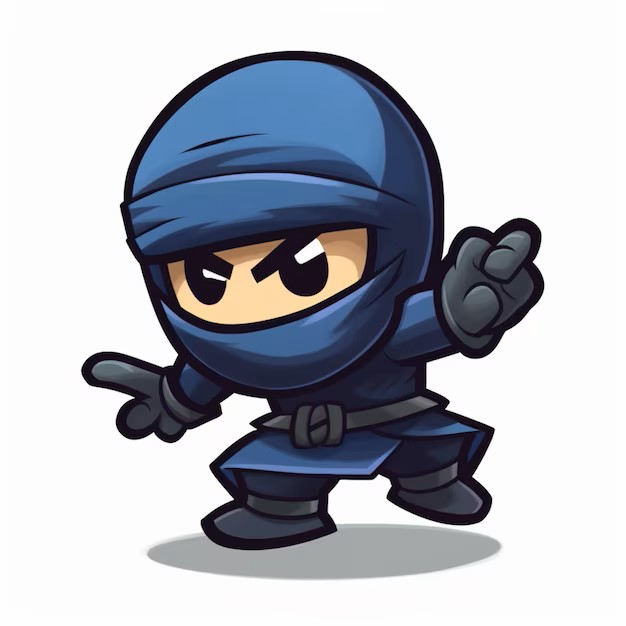

# Untitled Ninja Game

[CLICK HERE to play the game!](https://tdot123-1.github.io/untitled-ninja-game/)

## Description
In the Untitled Ninja Game you go on an adventure to save the princess. The goal is to try to reach the top of the mountain by jumping from platform to platform, while staying alive and avoiding the many obstacles and enemies. When the highest level has been reached you face the main enemy in a one on one fight. When the boss is beaten, the princess is saved and you have beat the game. If you lose all your lives at any point along the way you start over from the first level.

## MVP
1. Splash screen which introduces the story, explains controls, and a `start` button to launch the game.

2. At least one level where the player character starts at the bottom of the screen and has to reach the top of the screen by jumping various platforms.

    - The player can move left and right by using the `A` and `D` keys.
    - The player can jump by pressing the `W` key.
    - The player can throw his weapon left and right by using the `O` and `P` keys.
    - The player's jump has to look somewhat realistic, have a gravity system in place to pull the character back down after a jump.
    - The gravity has to increase when falling to show the player's downward speed increase when falling from great heights.
    - The player has to be able to stand on and jump from any platform without falling through.
    - The player has to fall down until a platform is reached, or else fall off screen.
    - The player has to lose one of its lives whenever it gets hit by an enemy or an enemy projectile, or when it falls off screen.
    - There have to be a minimum of 4 enemies, including one who can shoot projectiles at the player.
    - Whenever the player hits an enemy with his weapon, the enemy should 'die' and disappear.
    - Whenever the player loses a life, he gets returned to its starting location.
    - When the player lost all of its lives, it is game over and the end screen is displayed.
    - The player has to pass the current level when the highest platform is reached.

3. One level that acts as the 'boss fight' or final level. 
    - Level should only be accessed after the player has passed the first level.
    - The enemy boss should behave differently from regular enemies.
    - Level should be at least one degree more challenging than the previous level. 

4. End screen which gives feedback about how the player did, including a `restart` button which will restart the game from the first level without reloading the page.

## Current functionalities
1. All MVP functionalities.
2. Three levels (excluding the final level) with increasing difficulty.
3. Moving platforms.
4. 7 different enemy types with different behaviours.
5. Dialogue screens in between levels.
6. Different end screens depending on the outcome of the game.
7. Different game play mechanics in the final level.
8. Sound effects related to player actions.
9. Background music.

## Backlog
1. Either a timer to store quickest finishing times, or another system of collecting coins or some equivalent to keep track of high scores.
2. Expand on story and add more levels.
3. Add different enemy types to additional levels.
4. Possibly make playable on mobile .

## Data structure

**index.js**

    - startGame();
    - Event listeners for all relevant buttons and keys.

**game.js**
    

    - class Game
        - start();
        - levelTwo();
        - levelThree();
        - bossLevel();
        - restart();
        - displayPlayerLives();
        - showDeathView();
        - showVictoryView();
        - levelTransition(imageSrc, level);
        - nextLevel(level);

**player.js**

    - class Player 
        - move();
        - jump();
        - isStandingOnPlatform(platforms);
        - respawn();
        - renderPlayer();

**platform.js**

    - class Platform
    - class EndPlatform extends Platform
        - passedLevel(playerElement);
    - class MovingPlatform extends Platform
        - move();

**weapon.js**

    - class Weapon
    - class PlayerWeapon extends Weapon
        - throw(direction);
        - throwUp();
        - render();
        - returnWeapon();
    - class EnemyWeapon extends Weapon
        - throw(player);
        - render();
        - returnWeapon();
    - class MagicalWeapon extends EnemyWeapon
        - throw(player);
        - weaponHit(playerElement);
        - returnWeapon();

**enemy.js**

    - class Enemy
    - class BasicEnemy extends Enemy
        - move();
        - render();
        - didCollide(player);
        - gotHit(playerWeapon);
    - class ThrowingEnemy extends BasicEnemy
        - weaponHit(playerElement);
    - class EnemyBoss extends BasicEnemy
        - render();
        - respawn();
    - class MiniBoss extends BasicEnemy
        - move();
        - render();
        - respawn();
    - class FlyingEnemy extends BasicEnemy
        - fly();
        - return();
        - render();
    - class FloatingEnemy extends BasicEnemy
        - move();
        - render();

## States 

 - Flash view
 - Game view
    - Level one
    - Level transition view
    - Level two
    - Level three
    - Boss level
    - Victory view
    - Death view
 - End view

## Task
- Create index.html with sections for each game state.
- Create styles.css to set views width, position, background color. Specific styles for characters.
- Start on platform.js, place platforms on screen.
- Create player.js, implement player movement.
- Add event listeners to index.js to move player.
- Implement jump function on player class.
- Fine tune physics aspects to have right degree of gravity, velocity.
- Ensure player can jump on platforms without falling through.
- Implement throw weapon method on player class.
- Create enemy class.
- Place enemies on platforms.
- Implement collision detection between player, enemies, and weapons.
- Create checks for game over conditions.
    - Player lives is 0.
    - Final platform reached.
- Transition to end screen on game over, implement replayability.
- Create methods to remove elements after moving on to next view.
- Create boss level, place platforms.
- Create new enemy type.
- Implement transition from splash view, to level one, to final level, to end view.
- Create views specific to game outcome.
- Create views with story dialogue in between levels.
- Create additional levels.
- Create additional enemy types.
- Set background images for levels, platforms.
- Additional styling (font, icon).
- Add sound effects and background music.

## Links

- [Slides Link](http://slides.com) // to do
- [Github repository Link](https://github.com/tdot123-1/untitled-ninja-game)
- [Deployment Link](https://github.com/tdot123-1/untitled-ninja-game/actions)